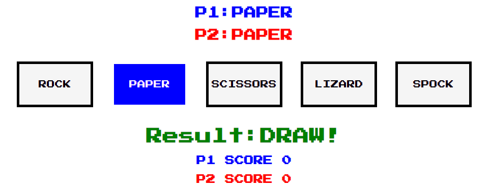

# Rock, Paper, Scissors, Lizard, Spock

[Play here](https://etherealsheep.github.io/Rock-Paper-Scissors-Lizard-Spock/)

"Rock, Paper, Scissors, Lizard, Spock" is a game teached by Sheldon Cooper, from The Big Bang Theory.

This is the enhanced version of the classic old game "Rock, Paper, Scissors".

It is a quick, fun and simple game, the rules are inside the game for better clarity, but they are not needed to play.

# **Features**

## **Header**
To make the game more captivating, a colorful image located at the top of the page (image source in the Credit section at the end of the readme).

The image contains the game name, which make it perfect and it gives immediate idea about the game you are going to play.

## **Fonts**
For this project, google fonts "Press Start 2P" has been chosen because I wanted to give the feeling of a retro-game, something old but enjoyable.

## **Player choice**
P1 is the player 1, the user.

P2 is the computer.

P1 and P2 choices are showed here, following the tradition of old school games, colors blue and red are assigned to each player.

## **Game Options**
The Game options are provided by five interactive buttons, one for each choice, selected button change colors putting some emphasys on the choice.

Every button, when selected, assign to the player the same choice.

## **Result**
- When the user select an option, the value associated to the selected option will be assigned to P1.
This is happening because an event listener called by the funtion, assign to the variables the clicked button value.
- The JavaScript code also generate at the same time a random value, between 1 and 5, and every number has a value associated.
This is called in the same function when the player pick up the choice.
- Another function is also called at the same time, to determine the winner. An else if cycle is used to determine the game result.

## **Score**
Last funtion is called to increase the score of the winner, P1 or P2.

## **Game Rules**
Games rules are listed here, for better clarity.

## **Footer**
The footer will shows the social media contact to check additional works from the creator.

## **Feature left to implement**
- I would like to implement sounds for every different fights (e.g.: Rock vs Scissors, or Lizard vs Spock).
- Add additional field  in the result, when the score difference is five or more points between P1 and P2, I would like to add additional sound effect and text (e.g.: Annihilated!).

# **Testing**
- The game has been tested in different browsers: Chrome, Firefox, Safari, Edge.
- The game results are correct and verified.
- I confirm that every part of the game is clearly visible, readable and very easy to understand.
- Font choice and colors are easy to read and accessible.
- Lighthouse result for mobile:

- Lighthouse result for desktop:

- I confirm that this project is responsive and it looks good on all standards screen sizes using the devtool device toolbar.

## **Bugs**
No bugs found working on this project.

## **Validator Testing**

### ***JShint Java Script Validator***
JavaScript file tested with JSHint JavaScript Validator (https://jshint.com/).

The following option has been selected before validation: Configure >> New JavaScript features (ES6)

No errors were returned,

### ***HTML Validator***
No errors were returned when passing through the official W3C validator (https://validator.w3.org/).

### ***CSS Validator***
No errors were returned when passing through the official Jigsaw validator (https://jigsaw.w3.org/css-validator/).

# **Deployment**
I deployed this website following the below steps:

*GitHub pages deployment* 

1. Log in to GitHub
2. In your Repository section, select the project repository that you want to deploy
3. In the menu located at the top of this section, click 'Settings'
4. Select 'Pages' on the left-hand menu - this is around halfway down
5. In the source section, select branch 'Master' and save
6. The page is then given a site URL which you will see above the source section, it will look like the following: 

Please note it can take a while for this link to become fully active. 

*Forking the GitHub Repository*

If you want to make changes to your repository without affecting it, you can make a copy of it by 'Forking' it. This ensures your original repository remains unchanged.

1. Find the relevant GitHub repository
2. In the top right corner of the page, click the Fork button (under your account)
3. Your repository has now been 'Forked' and you have a copy to work on

*Cloning the GitHub Repository*

Cloning your repository will allow you to download a local version of the repository to be worked on. Cloning can also be a great way to backup your work.

1. Find the relevant GitHub repository
2. Press the arrow on the Code button
3. Copy the link that is shown in the drop-down
4. Now open Gitpod & select the directory location where you would like the clone created
5. In the terminal type 'git clone' & then paste the link you copied in GitHub
6. Press enter and your local clone will be created.

# **Credits**
Header image has been taken from the internet, specifically from: https://learn.microsoft.com/en-us/samples/microsoft/rockpaperscissorslizardspock/azure-rock-paper-scissors/

The code from the footer was taken from my first project: https://etherealsheep.github.io/salento_sole_mare_vento/

---

## **Acknowledgements**

I would like to thank my course mentor Guido Cecilio for his support and guidance throughout the course of the project, he motivated and inspired me to do better and better.